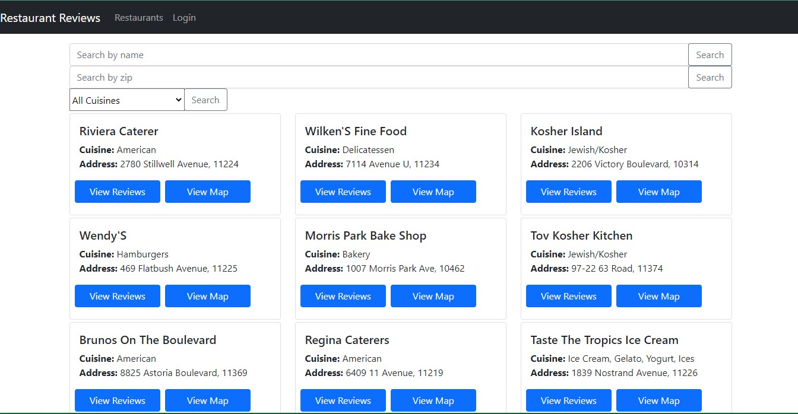

# Restaurant-reviews

Learning node this is my first server
 
I'm learning using Free-code camp youtube video by [Beau Carnes](https://github.com/beaucarnes)  
MERN Stack Course - ALSO: Convert Backend to Serverless with MongoDB Realm  
The Youtube video can be found [here](https://www.youtube.com/watch?v=mrHNSanmqQ4) 

The app is currently available at [restaurantsreview.netlify.com](https://restaurantsreview.netlify.com)

## Why this repo? 

Since the video was made with older versions of react, most of the stuff break with the current version, This is especially in the case of react-router-dom. 
For this reason I have searched for solutions and implemented them here. 
If you have a newer version than this or have some changes you would wish to make please reach out and we'll work something out. 
 
I'll be sure to document the changes when I finnish the course.
 
Happy Coding cheers 🥂 

